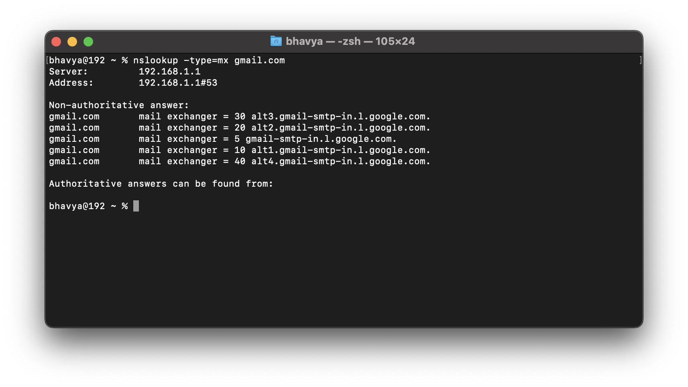
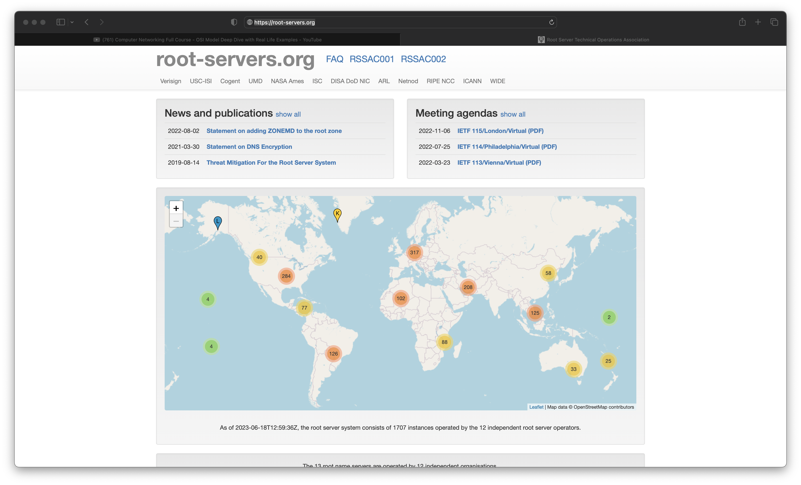
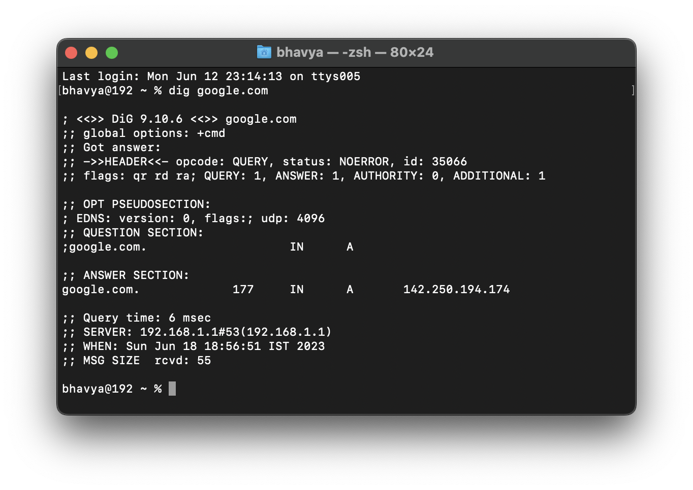

# Computer Networking

**Computer Network** - In simple terms - Computers connected together.

**Internet** - Collection of computer networks.


## How internet started?

Cold war - United States and Soviet Union - Battle of technologies - Soviet Union created Sputnik - United States created ARPANET for communication - Advanced Research Projects Agency Network - First computer network.
(MIT - Stanford - UCLA - Utah)

- Used TCP/IP (Transmission Control Protocol) - For communication between computers.

- Previously missing automated sharing - Here WWW (World Wide Web) was introduced - Stores documents and information - Tim Berners-Lee - Published on web servers - Based on hyperlinking of web pages.

- No search engine - Couldn't search for things - Save things in indices but not search - Built search engines - Yahoo being the first.

- Protocols - Necessary for communication - Decisions made by the *Internet Society* - To make submissions use RFC (Request for Comments) - Idea/Features.


## Client-Server Architecture

- google.com - Client - Sends request to server - Server sends response - Client displays response.

- Connections over continents and countries are made under the ocean - Fiber optic cables - Light pulses - Faster than radio waves - Less interference - More bandwidth - More expensive.

- A computer can be both client and server - Example: when using localhost.

- Use `inspect element` to see Networks tab in Chrome - Shows requests and responses - Can see the time taken for each request.

## Protocols

- Set of rules - Defined by the *Internet Society*.

### TCP

- Transmission Control Protocol

- It will ensure that the data is delivered to the destination and will not be courrupted.

### UDP

- User Datagram Protocol

- Do not care whether 100% of the data is delivered or not.

- Example: Video Conferencing

### HTTP

- Hyper Text Transfer Protocol

- Used by web browsers - WWW

- Defines format of the data being transferred bw clients and servers.


## How is data transfered?

- Data is sent in chunks called **Packets**.

> NOTE: Check Chrome Dev Tools > in Network Section > see all the API requests.

- IP Address is like a phone number - Unique to each device.

### IP Address Format

> X.X.X.X
> Each X is a number between 0 and 255.

Check IP Address of your computer:
```
$ curl ifconfig.me -s
```

### How IP Addresses are assigned?

Internet Service Provider provides us with a Modem or Router - It has a global IP Address - All the devices connected to the router will have the same IP Address for everyone around the world. (Such as Printer, Mobiles, etc.)

The Modem or Router will give IP Addresses to each of the devices connected to it, called the **Local IP Address**.

How does the Modem assign the Local IP Addresses?

Using DHCP (Dynamic Host Configuration Protocol). Set 
of rules to assign IP Addresses.

> If we make a request to Google.com, google will see the global IP Address. It will not know which device is making the request. So, it will send the response to the global IP Address. 

>The Modem will then forward the response to the device that made the request using NAT(Netwrork Address Translation).

How does the NAT know which application to forward the response to?

> Let's say we're running Mongo DB, make a request, and we want the response to be forwarded to the Mongo DB application.

**IP Address** decides which device to send the data to. 

**Port** decides which application to send the data to.

> Applications differ by the port number they use.


## Ports

Ports are 16-bit numbers.

> 16 cells that contain 0 or 1 -> 2^16 = 65536 total port numbers possible.

All the requests made by the browser are made to port `80`. (All the HTTP Stuff)

HTTP = 80
MongoDB = 27017

- All ports from 0 to 1023 are reserved ports for system use.

- Ports from 1024 to 65535 are reserved for use by applications.

- Remaining ports are free and can be used.

Your Computer -> Internet Service Provider (ISP) -> Another Computer

> Tier 1 ISP - Tata (In India) (Tata has a long cable from Chennai to Singapore)

> Tier 2 ISP - Airtel (In India)

- 1 mbps -> 1 mega bits per second -> 1 million bits per second. (10^6)

- 1 gbps -> 10^9 bits per second. [Very Fast]

- 1 kbps -> 10^3 bits per second. [Very Slow]

Upload -> When you send data to the internet.

Download -> When you receive data from the internet.


## Communication between two computers

- Guided way - Set of path already defined - Example: Telephone lines.
- Unguided way - No path defined - Example: Radio waves, Bluetooth.

### How are countried connected with each other?

Go to: https://www.submarinecablemap.com

Wires across the ocean - Single wire across continents

> Google owns a lot of them.

#### Guided 

- Optical Fiber
- Coaxial

#### Wireless

- Bluetooth
- WiFi
- 3G
- 4G
- LTE
- 5G

> Cables are faster than satellites.


## Connections

### LAN (Local Area Network)

- For small house / office.
- In an area.
- Connect as many devices as you want.
- Connect via Ethernet cable, Wifi.

### MAN (Metropolitan Area Network)

- Areas of a city.

### WAN (Wide Area Network)

- Across Countries.
- Using optical fiber cables.

#### SONET (Synchronous Optical Network)
Carries data using optical fibre cables.

#### Frame Relay
Connect LAN to WAN (internet).

> Internet is a collection of LANs, MANs, WANs. Connecting Local Area Networks to Wide Area Networks.

### Modem
Used to convert digital signals to analog signals and vice versa.

### Router
Routes the data packets based on their IP Addresses.

## Topologies

### Bus Topology
Every system connected to a Backbone cable.

```
    *        *
*------------------*
  *      *      *
```
CONS: 

- Backbone gets broken, all the systems are down.

- Only one system can transmit data at a time.


### Ring Topology

Every system communicates with one another.

```
    *  ---- *
  /            \  
*                *
 \              /
     * ---- *
```

CONS: 

- If one system fails, all the systems are down.

- Lot of unnecessary calls between systems.


### Star Topology

All computers connected to a central hub.

```
         *
         |
         |
  *----- * ------*
         |
         |
         *
```

CONS:

- If the hub fails, all the systems are down.

### Tree Topology (Combination of Bus and Star)

Many stars connected to a bus topology. 

```
         *
         |          *
         |         /
  *----- * ------* ---- *
         |        \
         |          *
         *
         |
         |
         *
        /  \
       *    *
```

PROS:

- More fault tolerance.

### Mesh Topology

Every system connected to every other system.

```
   *  ---- *  ---- *
   |     /       /
   |   /      /
   | /    /
   * /
```

CONS:

- Very expensive.
- Scalability is an issue.


# Structure of the Network

> Example:
You order food, restaurant sends the order to the kitchen, kitchen sends the order to the delivery guy, delivery guy delivers the food to you.

> Example:
You order something online. Amazon gets the order, sends the order to the delivery company, delivery company transports it. Arrived in India, assigns it to the delivery company resoponsible. Delivery company delivers the order to you.

This is how we can imagine internet.

The Application Layer is where you order stuff. (via application)


## OSI Model (Open Systems Interconnection Model)

This is how the internet works.

OSI Model is a standard model how two or more computers communicate with each other.

There are 7 layers in the OSI Model.

1. Application Layer
2. Presentation Layer
3. Session Layer
4. Transport Layer
5. Network Layer
6. Data Link Layer
7. Physical Layer

> Most important topic for interviews.

Every layer has different set of protocols and devices being used.

### Application Layer

Implemented in software. In the application (browser, messaging apps, etc.)

Send message to presentation layer.

**Application Layer Protocols**
- HTTP
- FTP
- SMTP
- DNS
- Telnet

### Presentation Layer

Takes the data from the application layer.

Data is in form of Words, Characters, Numbers, etc.
Presentation layer converts data into binary (machine readable format).

- From ASCII to EBCDIC.

- Called **Translation of data**.

- Goes under **Encoding** and **Encryption**, so that it is only readable to the person that the data was sent to.

- Also provides **Abstraction**.

Presentation layer assumes that if the data is sent downward, it will take care of it.

> Encryption, Compression, Translation.

**Presentation Layer Protocols**

- SSL (Secure Socket Layer) - For encryption decryption.

Data is sent to the session layer.

### Session Layer

Helps in setting up and managing the connections, including sending and receiving data, followed by termination of the session.

> Servers ask for username and password - that is **Authentication** - after that **Authorization** is done - Permission to access the data on the server.

Session layer assumes that if the data is sent downward, it will take care of it. (Basically all layers are independent of each other.)

### Transport Layer

Data is sent from the Session Layer to the Transport Layer.

Has UDP and TCP protocols to transfer data to another computer.

**TCP (Transmission Control Protocol)**
- Correction oriented transmission.
- TCP is slower than UDP.
- Sends acknowledgement to the sender to confirm that the data has been received.

**UDP (User Datagram Protocol)**
- Correction-less oriented transmission.
- UDP is faster than TCP.
- Data packets get lost or corrupted.
Doesn't perform error checking.
- Eg: Video streaming, Voice over IP.

Contains 3 steps:

#### 1. Segmentation 

- Data is broken into smaller chunks called **Segments**.

- Each segment has **source and destination's Port Number**, a **Sequence Number**.

- **Sequence Number** is used to reassemble the data in the correct order. (Chunks)

#### 2. Flow Control

- Transport layer controls the amount of data being transported.

> If server has 40mbps and client has 10mbps, then it wont work.

#### 3. Error Control

- Data packets got lost or corrupted.

- Adds **Checksum** to the data packets to see if data is good or not.


### Network Layer

Works for transmission of the received data segments from one computer to another. (Located in a different network)

- Router lies in the Network Layer.

**FUNCTIONS**:

- Logical addressing.
- Every computer has a unique IP Address. Network layer assigns the senders and receivers IP Addresses to every Segment. (Forms an IP Packet)
- Every data packet can reach its destination.
- Performs **Routing** - Decides the best path to reach the destination.
- **Load Balancing** - Divides the load between the servers. Makes sure that the servers are not overloaded.


### Data Link Layer

Allows you to directly communicate with Hosts and Computers.

Does 2 kinds of Addressing:

- Logical Addressing - At the Network layer about IP Address.

        EXAMPLE:

        - Source IP Address (192.168.1.1)
        - Destination IP Address (192.168.2.1)
        - Via Facebook (192.168.3.1)

        > Computer A has IP Address (192.168.1.1) sends data to Facebook Server having IP (192.168.3.1).

    Every packet has:
    - a source IP Address
    - a destination IP Address 
    - a Subnet Mask.

- Physical Addressing - At the Data Link Layer about MAC Address.

    Now, MAC Address is assigned to every packet, to form a **Frame**.

    Frame is a data unit of the Data Link Layer.

    MAC Address is a 12 digit alphanumeric number of the network interface of your computer.

    > Your computer's Bluetooth has a different MAC Address, WiFi might have a different one, etc.

    Every packet has:
    - a source MAC Address
    - a destination MAC Address

- Data Link Layer also controls how data is placed and received from the media. 

- Uses Media Access Control (MAC) protocols. To get things on and off of the media + Error detection.


### Physical Layer

Contains hardware, mechanical medium, wires, etc.

Converts the data into electrical signals.

When Reverting back:
When the data is received, it is converted into bits, pass to data link layer as a Frame.

```

YOU                     FRIEND
 |                        |
Application          Application
  |                       |
Presentation        Presentation
  |                       |
Session                Session
  |                       |
Transport             Transport
(Divides data             |
into Packets)             |
  |                       |
Network                Network
(Adds IP Address)         |
  |                       |
Data Link             Data Link
(Adds MAC Address)
  |                      |
Physical ------------ Physical
(Router)              (Friend's Router)
```

# TCP/IP Model (Internet Protocol Suite)

Similar to OSI Model.
Layers are reduced to 5.

1. Application Layer
2. Transport Layer
3. Network Layer
4. Data Link Layer
5. Physical Layer

Used practically (The OSI model is used more conceptually).

More detailed discussion about the different layers:

## 1. Application Layer

- Main layer for interactions with users.

- Consists of applications like web browsers, email clients, etc.
Eg: WhatsApp, Browsers, etc.

- Where: On your Devices.

- Protocols

- Client-Server Architecture

### Client - Server Architecture

```
Client ---sends request---> Server
Client <---sends response--- Server
```

- Client Part and Server Side part (Processes that communicate with each other)

- Servers should have High Availability and a Reliable IP Address to serve clients.

- Clients are ones using these resources.

- Collection of servers (in a big company lets say) is called **Data Centers**.

> Type in your terminal: `ping google.com`


> Every packet has a size of 64 bytes.
> Contains IP Addresses of Google Servers.

**Ping**: The round-trip time for messages sent from the originating host to a destination computer that are echoed back to the source.
(Best possible time, cannot be improved)

### Peer to Peer Architecture (P2P)

- Applications get connected to each other directly.

- No central server.

ADVANTAGE:
- Can be scaled rapidly.
- Decentralized Network.

Every single computer is a client and a server.

> Eg: BitTorrent


## Networking Devices

### Repeater
- Operates at Physical Layer.
- Regenerates the signal over the network.
- Doesn't amplify the signal.
- When the signal gets weak, it regenerates the signal to its original strength.
- Its a 2 port device.


### Hub
- Multi-port repeater.
- Regenrates signals over the same network when the signal gets weak.
- Connects multiple wires comming from different branches
- Cannot filter data.
- Doesn't have any intelligence to find out the best path for data packets.

2 types of hubs:

1. **Active Hub** - Have their own power supply, can clean boost and relay.
2. **Passive Hub** - Doesn't have their own power supply, colect wriring from nodes and power supply from the active hub.

### Bridge

- Operates at Data Link Layer.
- Type of Repeater, but it can filter data.
- It can filter data based on MAC Address.

### Switch
- Multi-port bridge.
- Operates at Data Link Layer.
- Can perform error checking before forwarding the data.

### Router
- Operates at Network Layer.
- Normally connect LANs and WANs.

### Gateway
- Passage to connect 2 different networks that operate on different protocols or Networking Models.
- Eg: Connecting a LAN to the Internet.

### Brouter
- Bridge + Router.


## Protocols

### On the Application Layer
### WEB PROTOCOLS

### TCP/IP
- HTTP (Hyper Text Transfer Protocol)
- DHCP (Dynamic Host Configuration Protocol)
- FTP (File Transfer Protocol)
- SMTP (Simple Mail Transfer Protocol) - Sending Emails
- POP3 (Post Office Protocol 3) and IMAC (Internet Message Access Protocol) - Receiving Emails
- SSH (Secure Shell) - Remote Login into somebody else's computer.
- VNC (Virtual Network Computing) - Remote Desktop Graphical control
- Telnet - Terminal emulation - `Port 23` - Manage account or device remotely - Not encoded or encrypted.
- UDP (User Datagram Protocol) - Stateless connection - Data might be lost.


## How applications communicate with each other?

Program: WhatsApp - has processes, lets say "Send a Message" and "Record a Video" - one program has many processes.

- **Thread** - Thread is a sequence of instructions within a program that can be executed independently of other code. A single process can have multiple threads.

Eg: "Send a message" has a thread for "Setting up the connection", "Sending the message", "Receiving the message", etc.

Communicate via IP Addresses and Port Numbers.

- **Sockets** - Send messages from one system to another system. (Its a software component that allows 2 processes to communicate with each other) - Interface bw processes and the internet.

- **Ports** - IP address tell which device to send the data to, Port tells which application to send the data to.

Eg: Many tabs of Google Chrome open. Deliver the message to which instance / tab?
- **Ephemeral Ports** - does the job of identifying the application - When the application is no longer using the Ephermal Port, it is released and can be used by other applications. (Exist on the client side)


### HTTP (Hyper Text Transfer Protocol)

- Client requests for a resource, Server responds with the resource. This happens with the help of HTTP.

- Client Server Protocol.

- Tells us how you can request for a resource and how the server should respond to the client.

- Client to Server HTTP Request, Server to Client HTTP Response.

- Every Application Layer protocol also requires a Transport Layer Protocol.

- Get request, Post request, etc.

- **TCP** is the Transport Layer Protocols used by HTTP.

- HTTP is a stateless protocol. (Doesn't remember the state of the client)
 
> If you send the request again and again, HTTP won't classify the request as one request. It will treat it as a new request everytime.

#### HTTP Method

1. **GET** - Get the resource from the server.

2. **POST** - Giving the data to the server.

3. **PUT** - Update the resource on the server.

4. **DELETE** - Delete the resource on the server.

> You can access all these methods in the Network tab in your Chrome Dev Tools.

Check out MDN Web Docs for more info about HTTP Headers.

#### HTTP Status Codes

Way of telling the client what happened with the request.

- 200 - Successful Request
- 404 - Not Found
- 400 - Bad Request
- 500 - Internal Server Error

We have classes of status codes:

- 1xx - Informational Category
- 2xx - Success Category
- 3xx - Redirection Category
- 4xx - Client Error Category (Something you did wrong)
- 5xx - Server Error Category (Something the server did wrong)

#### State saving behaviour - Cookies

- Cookies are small pieces of data that are stored on the client side.

- Unique string - stored in the browser.

- When you access a website for the first time a cookie is created and stored in the browser. When you access the website again, the cookie is sent to the server and the server knows that you have visited the website before. Server checks the cookie in database and sends the response with the saved state.


Whenever a server wants to set a cookie, it uses a tag called `set-cookie`. (See image above)

 It contains url, name, path, also has Expiration Date. (Cookies Expire)

 Sometimes cookies can be misused by websites to track whenever you visit their website.

 - **Third Party Cookies** : Cookies are set for URLs that do not visit.


 ### Emails

 #### How Emails Work?

 - SMTP, POP3 - Application layer protocol.

 - TCP - Transport layer protocol. (Data gets lost in UDP)

 > While sending an email from gmail to yahoo

>  SENDER -> SENDER'S SMTP SERVER -> (data is transfered) -> RECEIVER'S SMTP SERVER -> RECEIVER (downloads emails from server)

> If Gmail to Gmail, which means if the sender and receiver are on the same server then the above does not happen.

- **Name Server Lookup**: Type the following command in your terminal:
```
nslookup -type=mx gmail.com
```

Output:



#### Downloading Emails

**POP** 
- Post office protocol 
- Cliet connects to POP server 
- Uses PORT 110
- Does authorization via username and password.

```
       -- Authorize --> 
CLIENT                  POP SERVER
      <-- Transact --- 
```

- You can then download emails, perform actions such as deleting, etc.

> NOTE: The other items, such as the sent items, or drafts aren't sync using this protocol (POP).


**IMAP**

- Internet Message Access Protocol
- Allows us to view emails on different devices.
- Emails will be kept on servers forever.
- Local copies will be available.


### URLS and IP Addresses

**How does google.com find us a server?**

- Via DNS (Domain Name System)
- Domain names are mapped to IP Addresses.
- Stored in Database and DNS is used to look these up.
- When we search "www.google.com", HTTP Protocols take the domain name and find its IP Address, use DNS to connect to that server.
- DNS is like a phone book directory.
- Database is divided into classes

```
mail.google.com
____ ______ ___

here,
mail - subdomain
google - second level domain
com - top level domain
```

Multiple database for these 3 categories.

#### Root DNS Servers (TLD - Top Level Domain)

- First level of contact
- Root level domains are stored here.
- EG: .io, .com, .org, etc.
- Each have second level domains (SLD) - like google.com, student.io, etc.

> Check out https://root-servers.org/ for more info about Root DNS Servers and locations.


- ICAN - Internet Corporation for Assigned Names and Numbers (They register top level domains)


**How does google.com find us a server?** (Continued)

- User types google.com in the browser.

- Browser checks the local cache for the IP Address for google.com
(In your own computer so that you dont have to search again and again)

- If not found, it checks the local DNS Server. (Local DNS Server is the first point of contact - for eg: your ISP)

> 💡 Does not matter if you use incognito mode, your ISP knows everything you do. In case a mishap your ISP is liable to provide the information to the government.

- If not found, it checks the Root DNS Server. (TLD)

- If not found, ISP checks the Top Level Domain Server. (TLD)


```
own computer -> ISP -> Root DNS Server
                    <-
                (Not found, then)
own computer -> ISP -> TLD Server
                    <-
                  (IP Address)
```

> You cannot buy a domain name, you can only rent it. You have to pay a yearly fee to keep the domain name.


To see messages received by the DNS Server, type the following command in your terminal:
```
dig google.com
```

`dig` -> Domain Information Groper




## Transport Layer

**Role of the Transport Layer**
- Transportation of messages is done by transport layer.

- From Network to Application -> Done by Transport Layer.

- Which application is the message for? -> Done by Transport Layer.

- Provides abstraction.

```
your box ---transport layer---> courier company ------network layer------> courier company of receiver ----transport layer----> receiver's box
```

- Transport layer acts within the devices.

- Transport layer gives message to Network layer.

### TCP and UDP (Transport Layer Protocols)

 ```
 message -sockets->                                      ------- message
                      Transport       Transport
 file over mail -->     Layer     -->  Layer        -->         file over mail
                      Multiplexer     Demultiplexer
 voice call ------>                                             voice call
 ```

 Multiplexing allows us to send multiple messages at the same time over the same connection. (to multiple applications)

 What do we use to refer applications? -> Port Numbers

 Sockets -> Just like a gateway bw applications.

 - Data travles in packets.

 - Multiplexers attach the SOCKET PORT NUMBERS.

 - Transport layer takes care of **Congestion Control**. (Congestion - When packets get lost)

 > Can read more about congestion control algoritmns build in TCP.

 - Possibility that data gets lost or corrupted


### Checksum

- Transport layer adds checksum to the data packets to see if data is good or not.

```
message ----checksum----> receiver (checksum)
```

Both sender and reciever calculate checksum using an algo, if the is not same, then the data is corrupted. (Checksum is a string)

### Timers

How would you know if your data has been recieved by the receiver?

- Start the timer when the packet is sent.
- When the confirmation arrives the timer is stopped.
- Resets when another packet is sent.
- If packet gets lost, timer expires and packet is sent again. (retransmission timer )

[Each packet has a unique identification number]

## UDP

- User Datagram Protocol
- From Network to Transort Layer -> Done by UDP.
- Data may or maynot be delivered.
- Data may change on the way
- Data may not be in order
- Connectionless protocol
- Uses Checksums (you'll know the data is corrupted, but wont do anything about it)

### UDP Packet

- Every data packet has a port number, both source (`2 bytes`) and destination (`2 bytes`) - Total `4 bytes`.
- Length of the datagram (the packet) (`2 bytes`)
- Checksum (`2 bytes`)
(All of the above is the header of the packet - comes along with the data)
- Data

```
TOTAL SIZE OF THE PACKET: 2^16 = 65536 bytes
SIZE OF HEADER = 8 bytes
MAXIMUM SIZE OF DATA = 65536 - 8 = 65528 bytes

```

- UDP is faster than TCP.
