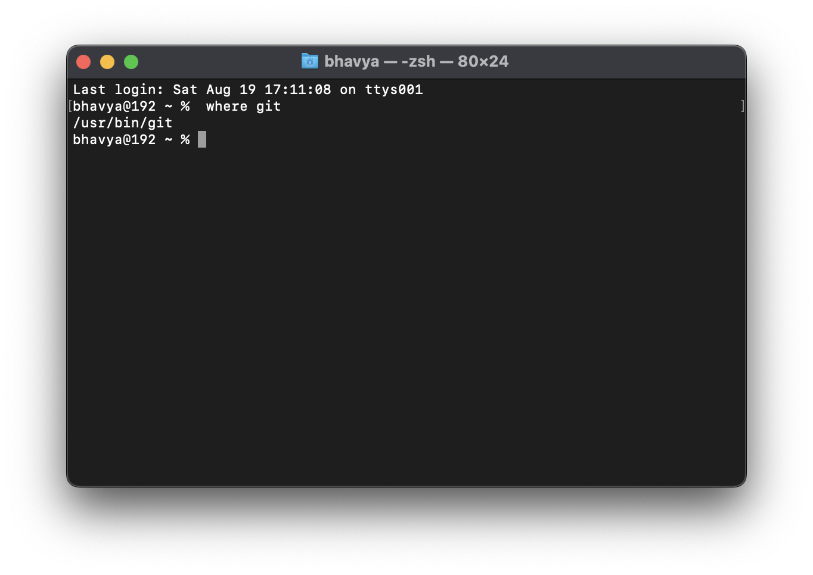
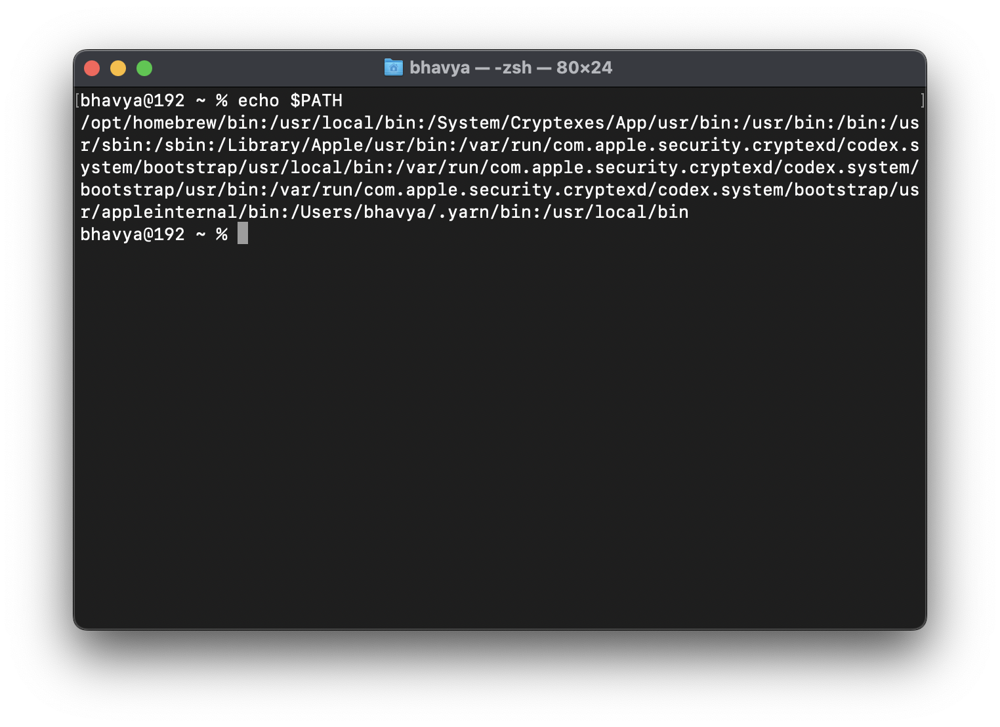
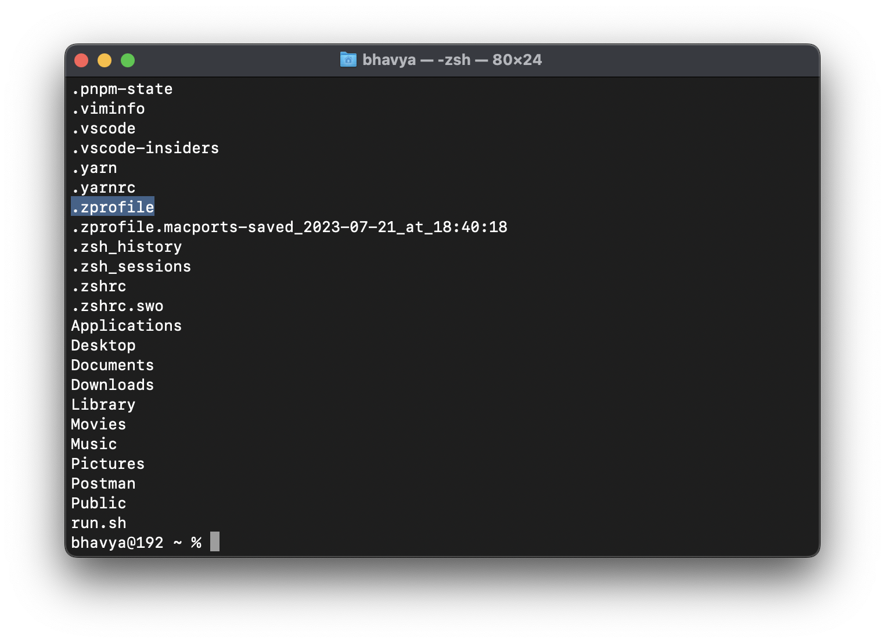

# Linux and Terminal Commands

## How to use the terminal

Working with various Terminal Configurations

(Learn shell scripting and bash scripting - more advanced - later)

iTerm - Terminal Emulator for Mac
- Terminal Emulator is an application that lets is use the terminal in a graphical way.

- Control your OS with the help of commands.

## Shell

What is a shell?

- A shell is a program that takes commands from the keyboard and gives them to the operating system to perform.
- Interprets the commands
- When we run `git` how does the computer know what to do? `git` is an executable file.
- Commandline interface that interprets commands and tells the OS what to do.

Types of Shells:
- Bourne Shell (sh)
- C Shell (csh)
- Z Shell (zsh) - "Oh my zsh"
- Bash Shell (bash)

## Root

- `root` is the username of the current user
- `@` is the seperator
- `number` is the hostname of the server
- `:/#` is the current directory


## Executable Files

How to check where the executable file is located?

```zsh
where git
```
```zsh
where python3
```



Now, if you copy the address and paste in the terminal it'll run the executable file.

## Commands

- `ls` - list all the files and folders in the current directory
- `open .` - open the current directory in the finder
- `mkdir folder` - create a new folder with name "folder"
- `cd folder` - change directory to "folder"
- `cd ..` - go back to the previous directory
- `cd` - go to the home directory
- `ls -a` - list all the files and folders including the hidden files and folders
-  `cat file` - print the contents of the file
- `touch file` - create a new file with name "file"

## Environment Varibles

- Named values that are used to change how commands and processes are executed
- Any instance of a running command is a process

Example:

The PATH Environment Variable 
```zsh
echo $PATH
``` 


- The PATH variable is a list of directories that the shell searches through when looking for a command to run.
- All the directories are seperated by a colon `:`
- If you wanna store passwords and secrets, you can store them in the environment variables.

## Bash Files

- When you open your shell some files are executed automatically.
- For example, when you open your shell, it automatically runs the `.bash_profile` and `.bashrc` files.

```zsh
ls -a
``` 



- Any file that starts with a `.` is a hidden file. 
- `cat .zshrc` - prints the contents of the `.zshrc` file. Contains Themes and Aliases