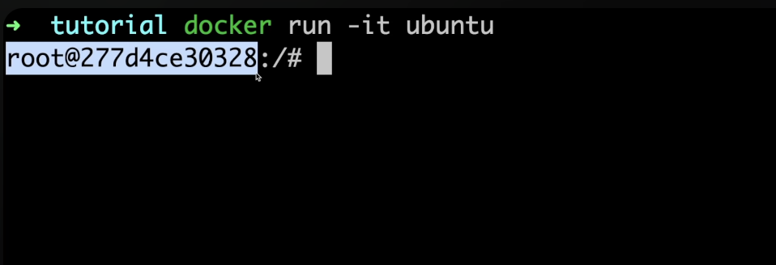

# Linux and Terminal Commands

## How to use the terminal

Working with various Terminal Configurations

(Learn shell scripting and bash scripting - more advanced - later)

iTerm - Terminal Emulator for Mac
- Terminal Emulator is an application that lets is use the terminal in a graphical way.

- Control your OS with the help of commands.

## Shell

What is a shell?

- A shell is a program that takes commands from the keyboard and gives them to the operating system to perform.
- Interprets the commands
- When we run `git` how does the computer know what to do? `git` is an executable file.
- Commandline interface that interprets commands and tells the OS what to do.

Types of Shells:
- Bourne Shell (sh)
- C Shell (csh)
- Z Shell (zsh) - "Oh my zsh"
- Bash Shell (bash)

## Root

- `root` is the username of the current user
- `@` is the seperator
- `number` is the hostname of the server
- `:/#` is the current directory



## Executable Files

How to check where the executable file is located?

```zsh
where git
```
```zsh
where python3
```
