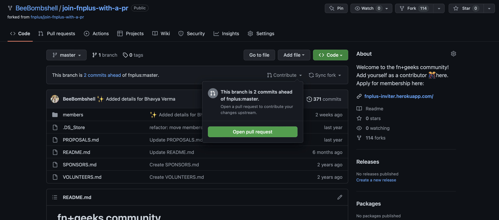

# Git and GitHub - Quick Reference 👾

## What is Git?

- Git helps **maintain who did what and when**. 
- It is a **version control system**. 
- It is a tool that helps you manage your source code history. 
- It allows you to track changes to your code and collaborate with others.

## What is GitHub?

- GitHub is a **code hosting platform** for version control and collaboration.

- Allows us to host our Git Repositories.


## Pre-requisites

- [Install Git](https://git-scm.com) on your system. (GUI Clients - not recommended)

## Terminal Commands

Terminal helps us to manipulate the file structure on our system.

- `ls` - List all files and folders in the current directory.

- `mkdir folder_name` - Make a new directory with the specified *folder_name*.

- `cd folder_name` - Change directory to the specified *folder_name*.


## Git Commands

- `git init` - Initialize an empty Git repository.

- `git status` - To know if the changes added have been reflected in the staging area.

- `git add .` - Put all the untracked files in the staging area.

- `git commit -m "commit message"` - Commit the changes in the staging area with a commit message.

- `git log` - To see the commit history.

- `git restore --staged file_name` - To unstage a file, back as untracked.

## Working with existing projects on GitHub

- Fork the repository to your GitHub account.

- Clone the repository to your local system.


- Add remotes to the repository.
    - **Origin**
        ```git
        git remote add origin "Your forked repository URL"
        ```

    - **Upstream**
        ```git
        git remote add upstream "Original repository URL"
        ```

- Make different branch for changes/feature you want to add.
    ```git
    git checkout -b "branch_name"
    ```

- Stage files using `git add .` 

- Commit changes with a commit message.
    ```git
    git commit -m "commit message"
    ```

- Push changes to your forked repository.
    ```git
    git push origin "branch_name"
    ```

## Pull Request

To request your changes from a branch in your repository to be merged into the main branch of the original repository.

After pushing, go to GitHub and create a PR from your branch to the original project.




## Creating git project

- Create a new repository on GitHub.

- Copy its URL (HTTPS or SSH).

- In CLI, in the project directory, run the following command.
    ```git
    git remote add origin "URL"
    ```

- To view all remotes:
    ```git
    git remote -v
    ```

- To push changes to the remote repository:
    ```git
    git push origin master
    ```

## Branches

- **Default** -  `Main` or `Master` Branch.

- **New Feature** - New branches for new features.

- `git merge` - To merge a feature branch into the main branch.

- `git reset --hard upstream/main` - To reset the main branch to the original repository.

- `git push origin main` - Now our main branch is in sync with the original repository (upstream main).


## Merge Conflicts and Squash Commits

To squash commits in 1 single commit, use the following command:
```git
git rebase -i "commit_id"
```
Where the   `commit_id` is the commit id of the commit before the first commit you want to squash.

This will open an editor with all the commits you want to squash. 

Change the word `pick` to `squash` for all the commits you want to squash.
All the the `squash` commits will be squashed in `pick` one.

Then add a message, and all the commits will be merged.


## Fetching and Pulling

To keep your local repository up-to-date with the remote repository.

```git
git fetch --all --prune
```

Here, 

`--all` fetches all the branches from the remote repository. 

`--prune` removes all the branches that have been deleted from the remote repository.

```
git reset --hard origin/main
```
This sets the main branch to the remote main branch.

```git
git push origin main
```
This pushes the changes to the remote repository. Now, the local repository is in sync with the remote repository.